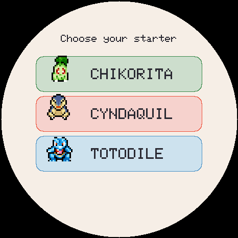
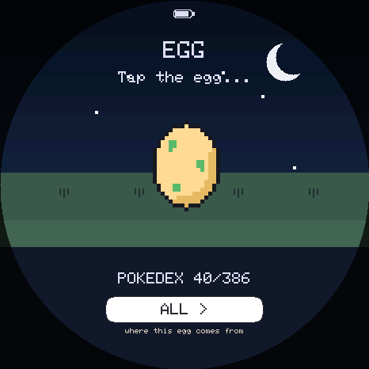
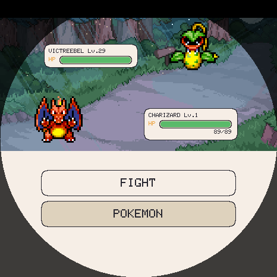
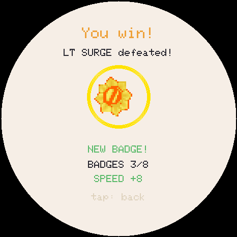
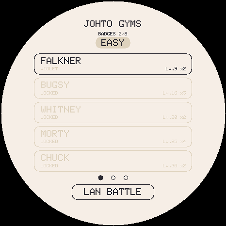
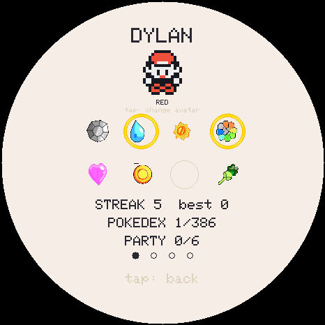
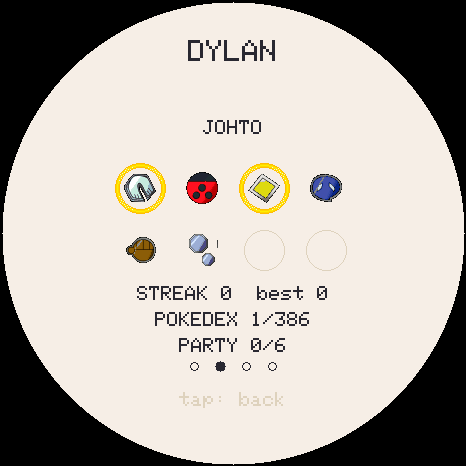
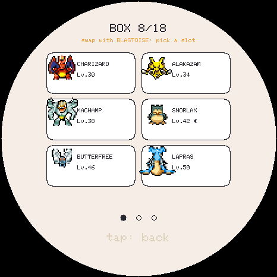

# TamaPoke

English | [简体中文](README.zh-CN.md)

[](https://nzlov.github.io/TamaPoke/)
[](https://makerworld.com/es/models/2937822-tamapoke-a-pokemon-pokeball-tamagotchi)


[](https://github.com/nzlov/TamaPoke/stargazers)

A gen-1-Pokémon-inspired tamagotchi for the
**Waveshare ESP32-S3-Touch-AMOLED-1.75** (round 466×466 AMOLED, CO5300 driver
over QSPI, CST9217 touch over I2C). Raise any installed species, evolve it, train it
and complete them all (shinies included).

> ### 🙏 Project lineage
>
> - **Current project:** [nzlov/TamaPoke](https://github.com/nzlov/TamaPoke)
> - **Upstream:** [DylanPDao/TamaPoke](https://github.com/DylanPDao/TamaPoke) by Dylan Dao
> - **Original upstream:** [socquique/TamaPoke](https://github.com/socquique/TamaPoke) by Quique Tortosa
>
> Quique created the original firmware, sprite pipeline, six-language UI and web
> installer. Dylan maintained and substantially expanded the next upstream
> branch. This repository continues from Dylan's upstream with its own runtime
> packs, Chinese UI and gameplay changes. If this project helps you, please also
> visit and support both upstream projects.
>
> The original code and derivative changes are available under the MIT License.

> **Personal, non-commercial fan project.** Code is MIT; the sprites are from
> PMD SpriteCollab (CC BY-NC, Pokémon © Nintendo/Game Freak), and the 3D case is
> CC BY-NC-SA. See **[License](#license)** and **Credits**.

🔴 **3D-printed Pokéball case + print profiles → [on MakerWorld](https://makerworld.com/es/models/2937822-tamapoke-a-pokemon-pokeball-tamagotchi)** · flash it in your browser → **[web installer](https://nzlov.github.io/TamaPoke/)**

## Latest release and package split

The supplied regional packs cover Kanto, Johto, Hoenn and Sinnoh and their
alternate-color forms, with a complete Simplified Chinese UI, names and
descriptions. The recommended installation path is the **[web
installer](https://nzlov.github.io/TamaPoke/)**: flash the firmware,
then deploy the selected languages and regions to the microSD. Arduino IDE is
not required.

The root installer is the latest published **stable release**. The separate
**[latest build](https://nzlov.github.io/TamaPoke/latest/)** follows `main` and
is intended for testing unreleased changes. Both pages show their channel,
commit and build date; use the stable release unless you specifically need to
test current development. Existing `/web/` links continue to redirect to the
stable installer.

The available species count is **determined by the region packs installed on
the device**; the Pokédex, eggs, battles and region selectors expose only that
available content.

Language, move, regional and question-bank content now lives in independently deployable
runtime packages. Install only the languages and regions you need, and update
content without recompiling the firmware:

| Package | Contents | Required |
|---|---|---|
| UI (`.tui`) | UI strings, layout metrics and fonts; Simplified Chinese is `ui-zh-CN.tui` | At least one |
| Moves (`.tmove`) | Move mechanics, learnsets, type chart, names and descriptions | Yes |
| Region (`.tregion`) | Species data, names and descriptions, animated/alternate-color sprites, thumbnails, trainers, gyms and badges | At least one |
| Questions (`.tquiz`) | Locale-indexed multiple-choice questions; records are read directly by random index | No; arithmetic is the fallback only when enabled |

The installer reads `web/packs/index.json` and checks each selection's
dependencies against both the packages already on the device and those selected
for this deployment. If anything is missing, it names the dependency and lets
you cancel or explicitly force the partial deployment. Regions absent from the
card remain locked and out of the egg pool. At boot the firmware validates each
package's ABI and CRC. Missing required packages open the built-in USB recovery
screen instead of an incomplete Pokédex, and an interrupted upload cannot
replace a working package.

After connecting, the installer also lists deployed package IDs and revisions,
can delete an individual package, and can format the microSD. Delete and format
operations require confirmation; restart the device after changing the card.

> **Upgrade note:** the first migration to runtime packages clears saves made by
> older firmware. For later same-schema updates, leave **Erase device** unchecked
> to preserve the current save; flashing does not delete packages on the microSD.
> ABI 4 stores precomputed sprite display scales and gender-specific sprite
> variants in every region pack, so redeploy all region packs together with this
> firmware; older region-pack ABIs are rejected.
> Region packages are large (a 40 MB package normally takes 10–15 minutes over
> USB serial). Restart the device after deployment.

For package generation and validation, see [Generate and load the data packs
yourself](#generate-and-load-the-data-packs-yourself) and [Runtime data
packs](#runtime-data-packs).

## Screens

All shots are straight off the 466x466 round panel, rendered headlessly by the
emulator (`tools/emu/tamapoke-emu --shot <name>`), so they are exactly what the
hardware draws.

### Starting out

| After language: pick a region | ...then its starter | Johto's three |
|---|---|---|
|  |  |  |

A new game first asks for the interface language, then which region you are
playing, and finally which creature you want. The region choice sets both: you
pick from that region's three starters, and it becomes where your eggs come from
afterwards (changeable later on the egg's region pill). Existing saves never see
this flow. Language names come from the installed UI packs; the first installed
pack drives the initial page, with English used when that choice cannot be loaded.

### Raising one

| Your creature | Its egg | Moves it knows |
|---|---|---|
|  |  |  |

The egg carries a **region pill** — pick whether it hatches from Kanto, Johto,
Hoenn or all three. Switching keeps the rarity it was granted and remembers each
region's answer, so it cannot be flipped to farm a legendary.

### Battling

| The fight | Choosing a team | Winning |
|---|---|---|
|  |  |  |

Turn- and move-based, with the real type chart, ailments and STAB. Real Game Boy
battle music plays throughout. Every local move opens a question before it acts:
damaging moves scale their final damage by the answer stage, while status and
healing moves take full effect after any correct answer and fail entirely after
a wrong answer or timeout. The AI always acts at 100%. In LAN battles each player
answers on their own device, the percentage travels with that move, and the host
remains authoritative. Keepalive frames prevent a long global question timer from
being mistaken for a dropped peer.

### Four regions

| Pick a ladder | Johto's gyms | LAN battle |
|---|---|---|
|  |  |  |

Kanto, Johto, Hoenn and Sinnoh each have eight leaders, an Elite 4 and a
champion, on easy and hard. The teams are the games' own, checked against the
pokecrystal, pokeemerald and pokeplatinum disassemblies -- **0 differences
across all 39 trainers**, re-checkable with `tools/verify_rosters.py`.

Sinnoh follows **Platinum**, where Fantina is the *third* gym rather than
Diamond/Pearl's fifth; the level ramp only runs 14/22/26/32/37/41/44/50 that
way. Same reasoning that makes Hoenn Emerald throughout.

### Collecting

| Pick a region | Kanto | Johto |
|---|---|---|
|  |  |  |

| Trainer card | Johto badges | The box |
|---|---|---|
|  |  |  |

## Status

Running on hardware. Implemented: installed species + shinies animated from
regional packs; six persistent cultivation slots and a 24-slot Box; the full
life cycle
(starter egg → evolution → farewell/release/runaway); bred-Pokédex with
gallery; turn-based trainer, wild and LAN battles; wild capture and shared item
inventory; battle stats (IVs + training); retention hooks (streak / bond /
medals / name); biome + real-time backgrounds; three training minigames;
care/battle questions backed by indexed banks or configurable arithmetic;
animated bath; RTC offline progression; battery (AXP2101), PWR key and
anti-burn-in dimming; **sound (ES8311)**; **7 UI languages (English default)**;
**starter choice on first run**; and a one-click **web installer**.

Pending: the 24–48 hour soak test. See **Roadmap**.

## Game manual (the actual numbers)

A quick reference to how the game really works (values straight from the code).

### Time & leveling
- **1 real minute = 1 in-game minute.** Your Pokémon gains **+1 level every hour**
  of real time. Leveling is purely time-based — caring well doesn't speed it up,
  but neglect *delays evolution*.
- **Level caps at 100**, reached 4 days 3 hours after level 1. Once a final form
  has actually been cultivated by this player for 3 days, the menu's Release
  row becomes Farewell. A wild creature's pre-capture age does not count.
- It keeps **aging while powered off** (the RTC runs), catching up to **2 weeks** max.

### The four stats (0–100)
Needs: **FOOD**, **JOY**, **ENE** (energy), **HYG** (hygiene). Start 80 / 80 / 80 / 100.
While **awake**, per minute:

| Stat | Drain/min | Notes |
|---|---|---|
| FOOD | −2 | |
| ENE | −1 | −1 extra if overweight (weight > 50 → sluggish) |
| HYG | −1 | **−4 more per poop** on screen (max 3 poops) |
| JOY | −1 | **−2 extra** if FOOD < 30, **−2 extra** if HYG < 30 |

- ~**15 %/min** chance to poop (only if FOOD > 40). Poops tank hygiene fast.
- **Care slip-up** = letting any stat hit **≤ 10** (60-min cooldown so it counts once).
  Each slip-up **delays evolution by 1 level** and cools the bond by 1.

### Actions
- 🍎 **Berry** (3 flavors): +25 FOOD. Each species has a **hidden favorite flavor**
  → +35 FOOD, +10 JOY, ♥, bond, and it gets revealed.
- 🍬 **Candy:** +10 FOOD, +12 JOY, but **+12 weight** (fattening).
- ⚽ **Ball / defence training:** **+5 JOY, plus 2 per rally** (max +35), trains
  **DEFENCE** (2 rallies = one score step), −ENE and burns weight. Leaving
  early keeps the actual score and still proceeds to its question.
- 🎯 **Reaction test:** a target appears, tap it before it shrinks away. Trains
  **SPEED**; the window tightens as you go.
- 🥊 **Training bag:** trains **STRENGTH** (~4 hits = one score step), tires it.
- 🫧 **Bath:** clears poops, HYG → 100.

Each active trainer awards a percentage of that stat's IV-based training ceiling:
`floor(ceiling × 30%) × score progress × answer percentage`, rounded to the nearest
point and clipped at the ceiling. A full session with a 100% answer therefore adds
at most 30% of the ceiling.

Choosing feed, bath or petting opens the modal question first, and the matching
success animation starts only after a correct result settles. Ball, reaction and
training-bag sessions ask their question after the session. Multiple-choice and
arithmetic questions can be enabled independently, and only enabled types appear;
when both are disabled the interaction runs directly at 100% with no modal. A
locale-matching multiple-choice question is selected by a direct random index from
installed `.tquiz` packs. If none matches and arithmetic is enabled, the firmware
creates an exact-rational arithmetic question from the global operator, operand, digit,
decimal, fraction and parenthesis rules. Arithmetic answers are entered on the
small on-screen numeric keypad, and equivalent decimal/fraction forms are accepted.
Long question text can be scrolled.

The answer timer has six equal stages. A correct answer applies **100%, 83%, 67%,
50%, 33% or 17%** of the positive result according to the current stage; for
example, answering at 15 seconds with a 30-second limit applies 50%. A wrong or
timed-out answer applies 0%: feed, bath and petting produce no benefit or success animation. Training still
keeps the real session record, energy/fullness cost and weight burn, but grants no
positive stat, joy or bond gain; a battle move fails entirely. Care, training and
battle share one global type, time-limit and generation configuration. LAN peers
may use different switches: a side with questions disabled submits 100% immediately,
the answering side keeps the link alive, and the host settles once both actions arrive.
- 👆 **Pet it:** after a correct answer, up to +5 JOY + bond according to the stage.
- 🌙 **Sleep:** rest — ENE **+6/min**, needs drain ~**4× slower** with floors
  (FOOD 30 / JOY 35 / HYG 45). No poops, no slip-ups, can't run away while asleep.
  **Screen off + between midnight and 06:00 puts it to sleep**, and it stays
  asleep until you turn the screen back on -- it wakes when *you* do, not at a
  fixed hour. Re-checked every minute, so a device put down at 23:00 nods off
  when midnight comes. The
  evening is deliberately outside the window -- a six-hour night is the only part
  of the day you are not expected to be around. The light
  button beats both: a creature you sent to bed stays there.

### Eggs & who you get
- **First ever pet:** you pick a starter — **Bulbasaur / Charmander / Squirtle**.
- Hatch the egg: tap it **3×** (or wait — it hatches on its own).
- A safety egg rolls a **rarity tier** over the ~79 base forms that come from eggs:

| Tier | Base chance | # species |
|---|---|---|
| ✨ Legendary | ~3 %\* | 5 |
| 🔵 Rare | ~27 % | 27 |
| ⚪ Common | the rest | 47 |

  \* Legendaries only start appearing once you've **registered ≥ 25** Pokémon.
- A daily **streak** and high **bond** push rare/legendary odds higher.
- Within a tier it favors species whose **evolution line you haven't finished** (so
  every species in installed region packs is completable).
- Every hatch rolls unique **IVs** (see below) — no two are identical.
- Endings normally create no egg. One safety egg is made only when all six
  cultivation slots and all 24 Box slots are empty; if the team is empty but
  the Box is not, its first creature is withdrawn instead.

### Evolution

**Cross-generation and branching evolutions come from region packs.** Targets
such as CROBAT, STEELIX, BLISSEY, KINGDRA, SCIZOR and PORYGON2 stay linked even
though they live outside their source species' region. Branching lines in the
installed catalogue are represented, including Gloom,
Poliwhirl, Slowpoke, Eevee, Tyrogue, Wurmple, Kirlia, Nincada, Snorunt,
Clamperl and Burmy. Every target is evolution-only rather than also hatching
straight from an egg.

`gen_dex_data.py --link` is the rule rather than a one-off edit: it fills in any
evolution whose target has since joined the table, and only ever touches rows
whose value is 0, so it cannot retune an evolution anybody already has. Sinnoh
brings ELECTIVIRE, MAGMORTAR and RHYPERIOR waiting on exactly the same thing.

- Triggers when **level ≥ its evolution level** (16 for most base forms; ~30 for
  stone-style, ~40 for trade-style) **and every stat ≥ 40** at that moment.
- **Never automatic** — a button appears and **you tap to witness it** (with a
  flicker between the old and new form). Each **slip-up delays it by 1 level**.
- You can **decline** ("keep form"); it re-offers at the next level.
- Branching species prefer an installed evolution you're still missing.

### Six cultivation slots and the Box
- The **six party slots are all cultivation slots**. Every occupied slot keeps its
  complete care, growth, move, IV, training and lifecycle state; all six advance
  together even though only one is shown on the main screen.
- Swipe horizontally to change the displayed creature. The indicators above
  the creature name show only occupied cultivation slots; tapping them opens
  the Box. Swipe down for the **bag / battle centre / badges** navigation page.
- The **Box holds 24 creatures** across four pages of six. Box state is frozen;
  exchanging a creature with a cultivation slot resumes it with no state reset.
- The Box is the only cultivation-management screen. Tap any Box cell: an empty
  cell accepts a chosen cultivation member; an occupied cell can be withdrawn
  directly when a cultivation slot is free, or exchanged with a chosen member.
- Box cells and embedded cultivation-member cards use the same 2× thumbnails,
  vertically centred in each row.
- A **runaway does not join.** It's the one ending with a cost, and letting a
  neglected pet come back on the team would remove it.
- A wild capture uses a free cultivation slot first, then a free Box slot. If both
  are full, the player explicitly chooses a replacement or lets it go; nothing
  is overwritten silently.
- Bag items have distinct icons everywhere they appear. Poké, Great and Ultra Balls
  use 1×, 1.5× and 2× catch modifiers; the four-star Master Ball is a weight-1 wild
  victory drop and catches any valid wild target without fail. Run
  `python3 tools/fetch_item_icons.py` before generating packs to use PokeAPI's
  original 24×24/30×30 item sprites; missing artwork keeps the built-in icon.
  The capture throw uses the image of the ball actually consumed.
- After a wild victory, a settlement page lists every item and training-stat gain.
  A successful capture adds the caught creature to that same page and stores it
  automatically. Only a full collection continues to the replace-or-release picker.
- Capture items hide the battle UI while the wild creature moves to centre for
  a non-blocking throw and three-shake sequence. Success finishes before the
  settlement page. After breaking free, the creature enters a non-stacking Angry
  state for the rest of the battle: its angry animation keeps playing, its five
  non-HP battle stats rise by 5%, and its escape chance gains 5 percentage points.
  HP is unchanged; it returns to its battle position before UI resumes.
- Gym and linked battles select from exactly the six cultivation slots.

### Three ways a creature leaves
- 💛 **Farewell** — after a final form has actually been cultivated by this
  player for **3 days**, the menu's Release row becomes Farewell. It adds
  **1 percentage point** to the wild shiny odds, or **2 points**
  when the creature is level 100.
- 💔 **Run-away** — if you let **all four stats sit at 0 for a full hour**. A single
  act of care cancels it. It subtracts **2 points** from the shared wild rare
  bonus, never below zero.
- 👋 **Release** — the menu action before Farewell is earned; neutral.

The shared bonus is clamped to **0–15 percentage points**. After one leaves, the
next cultivation member is shown, then the first Box member; only a completely
empty roster receives a safety egg.

### Bonds, streaks, medals, Pokédex
- **Streak** (player-wide, survives across pets): first care each real day; milestones
  at **3 / 7 / 30 / 100** days; skipping a day breaks it.
- **Bond** (per pet, resets on hatch): grows with affection (**cap +20/day**), cools on
  neglect. Streak and bond still improve a safety egg's rarity and IVs, but do
  do not enter the wild shiny roll.
- **8 medals** (Lv10/25/50, favorite berry found, 7-day streak, max bond, final form,
  "fit" = weight 0 & no slip-ups), per-pet + a global counter.
- **Pokédex:** raising a species registers it; completion covers every species
  and alternate-color form supplied by the installed region packs. Browse **one installed
  region at a time**, swiping horizontally to page within it.
- **Region:** the pill under a waiting egg picks which generation it comes from —
  **Kanto / Johto / Hoenn / Sinnoh / All**. A first egg gives that region's starter.
  A region whose **region pack is not on the card** shows as locked and is kept
  out of the egg pool. A partial data-pack install is a supported state.

### Battle stats & IVs
Every creature has four **IVs** — ATK / DEF / SPD / VIT:

```
stat = base + level + (IV × level)/100 + training
```

The `(IV × level)/100` term is the **real formula from Gen III onward**. 31 remains
the traditional maximum for ordinary rolls, but is not a system cap. IVs also
cap training.

| | Effect |
|---|---|
| Innate bonus | IV 31 contributes **+22** at level 73; higher IV keeps scaling |
| Training ceiling | `70 + (30 × IV)/31` → **77** at IV 8, **100** at IV 31 |
| Total spread | ~**40 points**, about **15 %** between a great and a poor individual |

- Hatch rolls are **8–31**; streak and bond may still bias a safety egg upward.
- Each ordinary wild IV is rolled independently at the current region/difficulty
  baseline **±3**.
- Wild **shiny variants** floor every IV at 20 without imposing a 31 cap; an
  already higher IV is preserved.
- Each gym can reward a given creature once. It picks any of the four IVs
  uniformly and adds **+1**, even when that IV is already 31 or higher.
- IVs are shown on the Battle page of the stat card; 31 and above are highlighted.

Training: **STRENGTH** ← the bag, **SPEED** ← the reaction test, **DEFENSE** ← the
ball game (and still 1 h of wellbeing passively). **VIT** can't be trained. All three
live in the training menu now; the ball moved off the home row when it became
defence's trainer.

Every hatch also rolls one of the 25 **natures**. The 20 non-neutral natures apply
the canonical +10%/-10% modifier to their final combat stats; HP is unaffected.
The five otherwise-neutral natures instead modify the training contribution and
its hourly decay:

| Nature | Training contribution | Hourly loss for affected training |
|---|---|---|
| Hardy | ATK +10% | ATK: 3% of its cap |
| Docile | DEF +10% | DEF: 3% of its cap |
| Serious | SPEED +10% | SPEED: 3% of its cap |
| Bashful | DEF +10%, ATK -10% | DEF: 3%; ATK: 7% (of each cap) |
| Quirky | ATK +10%, DEF -10% | ATK: 3%; DEF: 7% (of each cap) |

Unaffected training loses 5% of its IV-based cap per complete hour. Every loss
uses the cap rather than the current value and rounds up, both live and offline.
ATK training is also the special-attack training contribution; DEF training is
also the special-defence contribution. There are no separate special training
values.

Each hatch also uses its species' canonical gender ratio. Male creatures receive
+10% final Attack and -10% final Special Attack; female creatures receive the
reverse. Genderless species are neutral. The modifier is applied after nature,
and the chosen gender persists in the party and box. The UI shows a compact gender
icon, and region packs can provide female normal and shiny sprite variants; when
a variant is absent, the base sprite is used.

**TMs unlock at level 40**, all of them, and nothing before. A TM carries no level
requirement in the data — true of the games, wrong here, because a young creature
has few level-up moves and the spare slots were filled with the strongest TMs in the
table. A **level 1 Squirtle opened with SURF and BLIZZARD and could beat Brock.**

One number rather than a curve: the first five leaders sit at **14–43**, so you
fight the early ladder on what your species actually learns, and TMs arrive as you
enter the back half. A creature may qualify for farewell after three cultivated
days and caps at 100.

That only works because the move table now carries the **cheap early attacks** —
SCRATCH, PECK, POISON STING, BUBBLE, ABSORB, SPARK, FURY ATTACK and the rest. Before
them, ~15 % of species reached level 15 with no attacking move at all and were
quietly leaning on TMs to fill the gap.

**Gym wins train too**: each gym raises one random IV for the current creature.
Changing difficulty or rematching cannot claim it twice for that creature, but
a different creature has its own claim map.

Wild opponents have a **5% chance on normal difficulty and 20% on hard** to use
one available special mechanic: a Z-Move, Dynamax, or Mega Evolution.

- A Z-Crystal works for any species that has a damaging move; the move's type
  determines the generic Z-Move.
- Dynamax works for every species except Zacian, Zamazenta and Eternatus. An
  eligible Gigantamax species uses its Gigantamax state only when that individual
  has the persistent Gigantamax Factor. Eligible wild individuals have an
  independent **5%** chance to carry it, and Max Soup can grant it later.
- Mega Evolution is limited to species with an official Mega form. The standard,
  X, Y and Z stones are distinct and select that exact branch. The untransformed
  Pokemon has one shared normal/shiny appearance; the branch appears only after
  Mega Evolution.

### Battle weather and terrain

Trainer and LAN battles start with a clear field. A wild battle instead rolls
the foe biome's persistent environment: **50% clear, 30% primary weather, 10%
secondary weather, and 10% thunderstorm**. Cave and snow biomes cannot roll a
thunderstorm, so their secondary-weather chance is 20%.

| Biome | Primary | Secondary |
|---|---|---|
| Meadow | Harsh sun | Rain |
| Beach / Forest | Rain | Harsh sun |
| Cave / Volcano | Harsh sun | Sandstorm |
| Mountain | Sandstorm | Snow |
| Snow | Snow | Harsh sun |

A thunderstorm combines rain with Electric Terrain. This environmental weather
and terrain does not count down. **Sunny Day, Rain Dance, Sandstorm, Snowscape,
Electric Terrain, Grassy Terrain, Misty Terrain, and Psychic Terrain** cover the
matching layer for five turns, then reveal the wild baseline again. Damaging Max
moves set the corresponding Fire/Water/Rock/Ice weather or
Electric/Grass/Fairy/Psychic terrain.

- Harsh sun boosts Fire by 50%, halves Water, prevents freezing, and lets Solar
  Beam fire immediately. Rain boosts Water, halves Fire, and makes Thunder hit.
- Sandstorm chips non-Rock/Ground/Steel creatures by 1/16 and raises Rock
  special defence by 50%. Snow raises Ice physical defence by 50% and makes
  Blizzard hit.
- Electric, Grassy, and Psychic Terrain boost a grounded attack of their type by
  30%. Electric prevents sleep; Grassy heals grounded creatures by 1/16 and
  halves Earthquake against them; Psychic blocks positive-priority attacks
  against them.
- Misty Terrain halves Dragon damage against grounded targets and prevents their
  status conditions and confusion. With no ability system, only Flying-type
  creatures count as airborne.

The active weather and terrain are shown as localized HUD pills and animated
overlays. In LAN play the host sends absolute field state with every result, so a
dropped packet cannot leave the guest on a different field.

### Wild shiny encounters

Each wild encounter makes one shiny roll. Its base chance is exactly **1/4096**;
each farewell bonus point adds **1 percentage point**, up to a +15-point bonus
(about **15.0244%** total). A shiny uses the alternate sprite and persistent
gold/white particles, and floors every IV at 20 without clamping values above
31. Lists use one `*` marker. The main screen keeps its normal mood text, and the
single state persists through cultivation, Box storage, saves, battle and LAN
transfer. Old saves merge either former color or sparkle flag into this state.

### Choosing your egg's region

The species is decided when the egg **appears**, not when it cracks, so changing
region moves the egg you are holding. Two rules stop that being a re-roll button:

| | Rule |
|---|---|
| Rarity | the tier the egg was granted is **kept** — only which species of that tier changes, so flipping can never fish for a legendary |
| Memory | each region's answer is **remembered** for the current egg, so switching back shows the same creature |

The region is first chosen at the **very start of a new game**, on the screen
before the starter -- so the creature you begin with and the eggs that follow
come from the same place. Everything below is about changing it afterwards.

A region is decided by the **base** species, and evolutions follow wherever they
lead — a Kanto run still reaches Crobat and Blissey.

| | Training a win is worth |
|---|---|
| Easy | **3–5** points, **+1 per 3 leaders** deeper into the ladder |
| Hard | **6–10** points, same ladder bonus |
| Which stat | **random**, but only among stats **not already at their ceiling** |
| Who gets it | the **displayed creature**, and only if it was in the squad |

A random stat that landed on a maxed one would silently evaporate, so it never
picks one; and the IV-bound ceiling above still applies, so a win can never push a
stat past what its IV allows. Box members are frozen until exchanged into a
cultivation slot, and battling already costs the displayed creature energy —
that, not a cooldown, is what rate-limits rematching. A fully trained creature
is told so.

## Hardware

- Board: [ESP32-S3-Touch-AMOLED-1.75](https://www.waveshare.com/wiki/ESP32-S3-Touch-AMOLED-1.75)
  — get the **Standard** (no case) or **-G** (GPS, also fits) version; **not the "-B"**
  (ships with a protective case that won't fit). The separate "1.75**C**" is a different board.
- Round 466×466 AMOLED, **CO5300** driver (QSPI, 80 MHz)
- Capacitive touch **CST9217** (I2C, address 0x5A)
- **AXP2101** (power management + battery + PWR button), **PCF85063** (RTC),
  microSD slot, **ES8311** audio codec (→ amplifier → external speaker on the
  MX1.25 connector)
- Pins taken from the [official Waveshare repo](https://github.com/waveshareteam/ESP32-S3-Touch-AMOLED-1.75) (see `pin_config.h`)

## Libraries (Arduino IDE / arduino-cli)

| Library | Author | Use |
|---|---|---|
| GFX Library for Arduino (`Arduino_GFX`) 1.6.4+ | moononournation | CO5300 over QSPI + framebuffer in PSRAM |
| FreeType 2.14.3 (minimal vendored build) | FreeType Project / Espressif component | hinted OpenType rendering from UI packs |
| SensorLib | Lewis He | CST9217 touch + PCF85063 RTC |
| XPowersLib | Lewis He | AXP2101 PMU (battery, brightness, PWR button) |
| ESP_I2S (bundled in the ESP32 core) | Espressif | I2S to the ES8311 codec |

## IDE setup / build

- Board: **ESP32S3 Dev Module** · Flash **16MB** · PSRAM **OPI PSRAM**
  (required: the 466×466×16-bit framebuffer ≈ 434 KB lives in PSRAM) ·
  Partition Scheme with FAT (e.g. `16M Flash (3MB APP/9MB FATFS)`) ·
  USB CDC On Boot **Enabled**

```bash
FQBN="esp32:esp32:esp32s3:CDCOnBoot=cdc,FlashSize=16M,PSRAM=opi,PartitionScheme=app3M_fat9M_16MB"
TAMAPOKE_VERSION="$(python3 tools/firmware_version.py)"
FW_DEFINE="$(TAMAPOKE_VERSION="$TAMAPOKE_VERSION" python3 tools/firmware_version.py --cpp-define)"
arduino-cli compile --fqbn "$FQBN" \
  --build-property "compiler.cpp.extra_flags=$FW_DEFINE" .
arduino-cli upload -p /dev/cu.usbmodemXXXX --fqbn "$FQBN" .

# or just, which finds the port itself and can open the console:
bash tools/flash.sh --monitor
```

Supported local and Pages latest-build scripts stamp the firmware with the
current short commit ID and UTC build time. The stable GitHub Pages build uses
the published GitHub Release tag verbatim.

### Run it on your computer

`tools/emu/` compiles the **real firmware** — `TamaPoke.ino`, `pet.cpp`,
`i18n.cpp`, `party.cpp`, unmodified — into a clickable desktop app, stubbing only
the hardware. Click to touch, drag to swipe, type serial commands in the
terminal, and `--fast 60` runs a whole 3-day life in about an hour.

```bash
brew install sdl2 freetype # Debian: apt install libsdl2-dev libfreetype-dev
bash tools/emu/build.sh
tools/emu/tamapoke-emu --scale 2 --fast 60
```

There's a headless `--shot` mode for screenshots too. See
[`tools/emu/README.md`](tools/emu/README.md). It won't tell you anything about
timing, DMA tearing, PSRAM or audio — those still need the board.

### Easiest install: the web installer

`web/index.html` flashes the firmware (ESP Web Tools) and deploys UI, move,
region and question packs to the SD over Web Serial, no Arduino needed. The linked
`web/question-bank.html` imports banks from files or a connected device, searches and
paginates questions, edits, exports, builds and directly deploys indexed question banks.
Package/question IDs and the internal revision are maintained automatically; the page also
reads/writes the device's global answer rules. Serve it over HTTPS or `localhost`
(secure context) and open it in **Chrome/Edge**. See [`web/README.md`](web/README.md).

This runtime-pack migration intentionally resets saves created by older firmware.
Unknown save schemas are cleared instead of being interpreted as the new runtime
catalogue layout.

### Generate and load the data packs yourself

All sprites come from **[PMD SpriteCollab](https://github.com/PMDCollab/SpriteCollab)**
(CC BY-NC). `gen_data_packs.py` reads the generated per-species TPK2/TPTH files
directly and combines them with UI, species, move, description, trainer, battle
and badge data. No regional intermediate bundle is created. Newly packed sprites
also carry rear Idle/Hurt/Attack actions, so the player's battle Pokemon faces
away from the player. A missing rear action falls back to the matching front
action. Missing Mega, shiny Mega, or Gigantamax community art falls back to that
individual's available base normal/shiny sprite and remains listed in a coverage
report; the generator never invents a form image.

```bash
python3 tools/pack_pmd.py --report base-sprite-coverage.json
python3 tools/pack_pmd.py --mega --mega-report mega-sprite-coverage.json
# Mega outputs are pmNNN-{standard,x,y,z}[-shiny].bin
python3 tools/make_thumbs.py    # Pokédex thumbnails (from the PMD sprites) -> thumbs.bin
python3 tools/fetch_species_descriptions.py # append descriptions for newly added dex numbers
python3 tools/gen_data_packs.py # web/packs/*.tui, *.tmove, *.tregion, *.tquiz + index.json
python3 tools/check_data_packs.py
```

The checked-in Chinese font subset already covers every string, species, move,
type and regional description in the catalogue. When localized content gains
characters, rebuild it from Noto Sans SC Medium (or the compatible CJK SC face)
with FontTools before
regenerating the packs:

```bash
python3 tools/subset_ui_font.py /path/to/NotoSansCJK-Medium.ttc \
  tools/assets/fonts/NotoSansCJKsc-Medium-subset.otf --font-number 2
```

Then deploy the selected packs from the Web installer. The firmware only accepts
validated pack files under `/packs`; interrupted uploads use a temporary file and
cannot overwrite a working pack.

Question-bank authoring JSON lives under `tools/question_banks/`; each source is
compiled into an indexed `.tquiz` and added to the generated web catalogue. The
browser question-bank editor provides the same binary format without requiring the
Python pipeline.

## How to play

On first run you **choose a starter** (Bulbasaur / Charmander / Squirtle). After
that you start with an **egg**. Tap it 3 times or wait and it hatches. From then
on, care for your companion:

**Four stats** that decay: **FOOD**, **JOY**, **ENE** (energy), **HYG** (hygiene).
If one bottoms out it counts as a *slip-up*.

**Buttons (bottom arc, icons):**
- 🍎 **Feed** → food menu: 3 berries (each species has a hidden favourite that
  gives a bonus) and a candy (+happiness but it fattens; weight makes it sluggish).
- ⚽ **Play** → the pokeball minigame (joy only).
- 🌙 **Light** → sleep/wake (recovers energy, dims the screen). While asleep,
  needs decay much slower (rest).
- 🫧 **Bath** → a foam scene that cleans up the poops.

**Touch gestures:**
- **Tap the name** at the top = the **menu** (stats / Pokédex / Settings /
  Release or Farewell). Close it
  with the CLOSE row, by tapping anywhere outside the panel, or with any swipe.
- Tap the occupied-slot indicators above the name to open the Box.
- Tap the creature = pet it (+happiness, bond).
- Horizontal swipe = switch between the occupied cultivation slots.
- Vertical swipe up = open the **stat card** (4 pages: Profile / Battle / Moves /
  Progress; swipe between them; tap the name on Profile to rename; on Battle the
  "Train strength" button opens the bag).
- Swipe down = open the **bag / battle centre / badges** navigation page.

**Physical PWR button:** short = screen on/off · long (4 s) = full power-off
(the RTC stays alive, so time passes even while it's off).

## Decisions: you choose, and you watch

Evolution, Farewell and Release **don't happen on their own**; a button or menu
row opens their confirmation dialog:

- **Evolution** (red button): *Evolve* (epic animation: halo, rays, sparkles and
  a **flicker between the old and new form**) or *Keep form* (re-offered next level).
- **Farewell** (menu, final form + 3 cultivated days): a warm rising-heart scene,
  then +1 point to both wild rare odds, or +2 at level 100. Before qualification,
  the same menu row is the neutral **Release** action.
- **Runaway** (dark button, total neglect for 1 h): a somber "feels abandoned"
  ending in the rain — caring for the creature cancels it.

  **It does not ask, and that is the point** -- a creature you have to authorise
  to leave is not really at stake. What it must never be is the price of going
  to bed, so **the screen being off between midnight and 06:00 puts the creature to
  sleep**, and sleep floors the stats at FOOD 30 / JOY 35 / HYG 45 with the
  neglect check skipped entirely. A night costs you a hungry, grubby creature at
  breakfast instead of an empty one.

  **Both halves are needed.** The screen alone would pause the game every time
  you pocketed the device, and the creature is meant to get hungry during the
  day. The hour alone would send it to bed while you were still playing. Set the
  clock in **SETTINGS** (or `RTCSET`); a board whose clock was never set simply
  never auto-sleeps, which fails safe -- it keeps draining and the light button
  still works by hand.

  This was a real loss: a player left the board running overnight and came back
  to a Dratini that had gone. The live tick was the only drain path with no
  floor -- offline floors at 15, sleep at 30/35/45 -- so a board left *running*
  was punished where a board switched *off* was not. `night_test` runs ten
  simulated hours and fails if that ever comes back.

## Runtime data packs

- **UI (`.tui`)** — one installed language per pack: strings, layout metrics
  and either a compact bitmap face or a hinted OpenType subset with package-defined
  pixel sizes. The language list is discovered at boot.
- **Moves (`.tmove`)** — stable move IDs, mechanics, learnsets/TMs, type chart,
  names and localized descriptions.
- **Regions (`.tregion`)** — species records, localized names and descriptions,
  PMD sprites, thumbnails, region metadata, trainers, regional battle configuration
  and badges.
- **Questions (`.tquiz`)** — language spans, fixed-width random-access indexes and
  variable-size question records. Only the selected index row and question record
  are read from the microSD; the whole bank is never loaded into memory.

Sprites are read lazily from the region pack into PSRAM. OpenType faces and their
bounded glyph cache also live in PSRAM; neither fonts nor sprites are embedded in
the firmware. There is no embedded or
loose-file pet-sprite fallback; missing required packs lead to the small built-in
USB recovery screen instead of starting with incomplete catalogue data.

## Pokédex and species data

`tools/dex_data.py` is the source for name, slug, type (accent colour +
background biome), evolution line with gen-1 levels, rarities and starters.
`tools/dex_stats.py` has the base stats and `tools/dex_types.py` the typings and
type chart (both from PokéAPI). Note these are **current** values, not Gen 1 ones —
Pidgeot has 101 Speed here, not the 91 it had in Red/Blue. The generator emits
these records into region packs; `dex.h` contains only the stable runtime ABI and
limits. The pet's identity is its Pokédex number (persisted in NVS).

- **Evolution** gen-1 style (levels 16/36/…; stones ≈30, trade ≈40; Eevee
  branches to whichever evolution you're missing). Each slip-up delays it 1
  level; it won't evolve with any stat < 40 or while asleep.

## Types

Every species carries its real **typing** (one or two of the 18 types) and the game
ships the full **18×18 effectiveness chart** in the move pack, generated from
`tools/dex_types.py`.

The chart is the **current (Gen 6+) one, not Gen 1's**, which is a deliberate call:

- Gen 1's chart shipped real bugs — Ghost moves did literally nothing to Psychic —
  and Psychic was resisted only by Psychic, so it ran away with every fight.
- The base stats here were **already** pulled from PokéAPI at current values, so
  modern stats with an ancient chart was the inconsistent pairing.
- **Fairy earns its keep:** Dragonite has the highest Attack in the dex, and before
  Gen 6 Dragon was resisted only by Steel. Dragon → Fairy is **0×**, so Clefable
  hard-walls the strongest thing you can hatch.

Seven of the original 151 differ from their Gen 1 typing: Magnemite and Magneton gained Steel
(Gen 2), and Clefairy, Clefable, Jigglypuff, Wigglytuff and Mr. Mime gained Fairy
(Gen 6) — the first two losing Normal entirely.

Typing is shown on the Battle page of the stat card and drives trainer, wild and
LAN battle damage.

## Battle stats and training

Each creature has ATK/DEF/SPD/VIT = **base stat** + level + **IV** (ordinary
rolls stop at 31, but stored values and gym rewards are not capped; `IV × level/100`) + **training**, followed
by its nature modifier and then its gender modifier (see
[Battle stats & IVs](#battle-stats--ivs)):
- SPEED ← the **reaction test** (~2 reactions = one score step)
- DEFENSE ← the ball game (~2 rallies = one score step), plus 1 h of wellbeing = +1
- STRENGTH ← the training bag (~4 hits = one score step)
- VIT (vitality, from the base HP stat) — not trainable

### Moves

Each creature knows up to **4 moves**, from a pool of 77. Two kinds:

- **Level-up moves** are gated: Charizard learns FLAMETHROWER at 34, WING ATTACK
  at 36, DRAGON RAGE at 54. A hatchling starts with **only** what its species
  knows at level 1 — a Charmander opens with GROWL alone, and the other three
  slots stay empty. Crossing a gate fills an empty slot silently; with all four
  full you get a **prompt** asking which to forget (or to skip it). Offers queue,
  so coming back to a pet that aged two weeks offline asks one at a time.
  Evolving keeps the moves it already has, and the new form's gates take over —
  moves it would have learned *below* your current level are not backfilled,
  same as the real games.
- **TMs** have no level gate and are chosen on demand, from the **MOVES** page of
  the stats card (swipe across, then tap a slot).

Levels come from FireRed/LeafGreen, the Kanto games that still gate properly.
A move that is *also* a TM keeps its level gate — otherwise every gated move
would come free, since most of them were sold as TMs at some point.

Moves remain part of each creature's complete state. They continue with it
between cultivation slots and freeze only while that creature is in the Box.

**Special attack and defence** come off the species' own `bSpA`/`bSpD` base stats
(Alakazam is 50 Attack but 135 Special Attack), reusing the physical IV and
training rather than rolling their own: special attack runs off the ATK IV and
training, special defence off the DEF IV and training. So the physical/special
split lives on the species, not the individual — no extra IVs to roll.

The IV also sets **how far each stat can be trained at all** (77–100), so a
well-rolled individual has a genuinely higher ceiling, not just a head start.
See [Battle stats & IVs](#battle-stats--ivs) for the numbers.

Shown on the Battle page of the stat card. The (hidden) weight goes up with candy
and burns off with training.

## Retention: streak, bond, medals, name

- **Streak** (the player's, persists across creatures): the first care of each
  real day advances the streak; 3/7/30/100 milestones are celebrated; skipping a
  day breaks it. Flame badge on the main screen.
- **Bond** (the creature's): rises slowly with care and petting, drops with slip-ups.
- **Medals** for the individual (level, berry, streak, bond, final form, fit) +
  a global counter. Medals page of the stat card.
- **Name**: touch keyboard; the nickname rules the header and the card.

High streak and bond improve a safety egg's rarity and IVs. Wild shiny encounters
use only the shared farewell bonus.

## Life cycle, wild rare traits, languages

After a final form has been cultivated for **3 days**, it may Farewell; before
that it may be Released from the menu. All four bars at zero for 1 h causes a
Runaway. Farewell adds +1 point to the wild shiny odds (+2 at level 100), Runaway
subtracts 2, and Release is neutral; the shared bonus is clamped to 0–15.

Wild shiny odds start at exactly 1/4096. One roll controls both the alternate
sprite and persistent particles; its IV floor is 20 and does not clamp values
above 31. Endings remove the creature instead of banking it, and create a safety
egg only if team and Box are both empty.

**Languages:** the supplied pack set includes English (default), Spanish, French,
German, Italian, Portuguese and Simplified Chinese. The firmware does not hardcode
that list: only installed `.tui` packs appear in settings.

## Backgrounds: biome + real time

The idle screen paints the sky from the **RTC's real time** (dawn / day / dusk /
night with moon and stars) and the ground from the **type's biome** (meadow,
beach, forest, volcano, mountain, snow). Sleeping forces night.

## Layout

- `TamaPoke.ino` — init, game loop, render of every screen, gestures, serial console, audio
- `pet.h` / `pet.cpp` — pet state and logic (stats, evolution, life cycle, streak/bond/medals, NVS)
- `party.h` / `party.cpp` — six cultivation records, active switching, migration and the 24-slot Box
- `content.h` / `content.cpp` — pack ABI, CRC validation, catalogues, descriptions and lazy assets
- `quiz.h` / `quiz.cpp` — global answer rules, exact arithmetic generation/input and timed settlement
- `sdmon.h` / `sdmon.cpp` — packed TPK2 sprites + thumbnails and atomic pack reception over USB
- `rtcbat.h` / `rtcbat.cpp` — PCF85063 RTC + AXP2101 PMU (battery, brightness, PWR button)
- `audio.h` / `audio.cpp` — ES8311 + I2S + Game-Boy-style tone synth (non-blocking task)
- `i18n.h` / `i18n.cpp` — dynamic installed-language selection and string IDs
- `dex.h` / `moves.h` — stable firmware ABI; catalogue records live on the SD
- `ui_art.h` — generated core UI icons/colours; pet sprites only exist in region packs
- `pin_config.h` — the board's official pins
- `tools/` — pipeline: `dex_data.py` (data), `dex_stats.py`, `dex_types.py`,
  `sprites.py` (workshop), `pack_pmd.py` / `make_thumbs.py`,
  `gen_data_packs.py`, `quiz_pack.py`, validators and `touch_log.py`
- `tools/emu/` — desktop emulator (real firmware + stubbed hardware, SDL)
- `tools/sdcard/mons/` — generated sprite inputs (animated, alternate-color, PMD, thumbnails)
- `web/packs/` — deployable UI, move, region and question packs plus their dynamic catalogue
- `web/` — the browser installer and question-bank editor (ESP Web Tools + Web Serial deployment/configuration)

## Serial console (115200, debug)

`STATS` (full state) · `SPEC <dex>` (change species) · `LVL <n>` ·
`IV <atk> <def> <spd> <vit>` (force individual values) · `HATCH` ·
`EGG <dex> [color]` (hatch a chosen species for debugging) ·
`SHINY` / `SPARKLE` (toggle the combined shiny state) · `NICK <x>` ·
`BYE` / `RUN` (farewell / runaway) · `ABANDON` (force the
runaway-ready state) · `WIPE` (factory reset → new game) · `BEEP` (audio test) ·
`REG` (Pokédex) · `EGGS` (simulate 20 eggs) · `GAL` (gallery) · `CAREDAY` ·
`PARTY` / `PARTY <dex>` / `PARTY CLEAR` (inspect and fill the party) ·
`TIME <epoch>` / `RTCSET <epoch>` · `HEALTH` (uptime + heap for the soak test) ·
`LS` / `GET` / `PUT` (list, read or deploy validated `/packs` files) · `QUIZCFG` (read global answer rules) ·
`QUIZSET <time> <ops> <terms> <operandDigits> <answerDigits> <decimals> <fractionDigits> <flags> <parenthesisDepth> <choiceWeight> <questionTypes>`, where `questionTypes` is a bit mask: multiple choice `1`, arithmetic `2`.

To test fast: lower `PET_TICK_MS`, `MINUTES_PER_LEVEL` and `FAREWELL_AGE_MIN` in `pet.h`.

## Roadmap

- **Soak test** 24–48 h (instrumentation ready: `HEALTH` command/heartbeat).

*(Done: 3D-printed case [published on MakerWorld](https://makerworld.com/es/models/2937822-tamapoke-a-pokemon-pokeball-tamagotchi); repo public with the browser installer + one-click sprite bundle.)*

## Community forks

- **[TamaPoke — Expanded](https://github.com/ShadowEnemyx/TamaPoke/tree/tamapoke-expanded-update)** by **ShadowEnemy** — a substantial community fork (different author/branch): a full **type-matchup battle system**, all **151 + shinies** with a **Pokédex / collection box** and daily goals, **6 UI languages**, **ES8311 sound**, starter choice and a one-click web installer. Worth a look. 🎮

## Credits

All sprites: [PMD SpriteCollab](https://github.com/PMDCollab/SpriteCollab)
(community, CC BY-NC). Base stats: [PokéAPI](https://pokeapi.co). Pokémon is a ™ of
Nintendo / Game Freak / The Pokémon Company. Non-commercial, personal-use project.
Full list in [`CREDITS.md`](CREDITS.md).

## License

- **Source code** (firmware + tooling): **[MIT](LICENSE)**.
- **Sprites & names**: © Nintendo / Game Freak / The Pokémon Company; pixel art
  from [PMD SpriteCollab](https://github.com/PMDCollab/SpriteCollab) (CC BY-NC 4.0).
  **Non-commercial use only.**
- **3D-printed case**: remix of *"Pokeball"* by **yoyothechicken**
  ([MakerWorld #839922](https://makerworld.com/es/models/839922-pokeball)),
  licensed **CC BY-NC-SA**, and shared here under the same terms.

This is an unofficial fan project, not affiliated with or endorsed by Nintendo.
